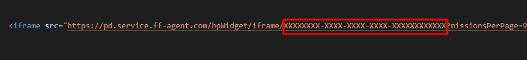

# FF Agent Stats

This is a [Next.js](https://nextjs.org/) project bootstrapped with [`create-next-app`](https://github.com/vercel/next.js/tree/canary/packages/create-next-app). It proxies requests to the mission statistics API of the [ff-agent](https://www.ff-agent.com/) that can provide data for your help organization.

## Why this proxy API

The API for mission statistics provided by the ff-agent team does not support to be fetched directly from other websites.
The reason is probably that they provide an iframe to display mission statistics, iframes have no CORS problem since they are sandboxed from the rest of the website.
But if you want to build a custom statistics integration (e.g. only a small widget for the homepage), you can use this proxy api that allows requests from every domain and forwards them to the ff-agent API and returns the response if successful.

In addition to forwarding the requests, this API also returns the counted statistics instead of objects for every mission.

## Getting Started

You can either use the hosted version ([ff-agent-stats.vercel.app](https://ff-agent-stats.vercel.app/) hosted for free by Vercel 🙏) of this proxy API directly or fork it on GitHub and host wherever you want.
Either way you need to get the ID of your ff-agent mission statistics, which you can get by copying it from the iframe snippet that the ff-agent provides.
See the ID marked red in the example:


To check whether your ID is working you can use the homepage provided with this Next.JS project and paste it there and click "Fetch Stats".

### Iframe Integration (simple setup)

```html
<iframe src="https://ff-agent-stats.vercel.app/iframe/<YOUR-AGENT-ID>" height="100" width="300" title="Our Mission Count" style="border: none;"></iframe>
```

### API Integration (more flexibility)

You can query one of the two possible endpoints to get mission statistics of your help organization:

- `api/latest?id=XXXX-XXX...`: returns the mission count of the current year, month and day
- `api/year/2023?id=XXXX-XXX...`: returns the mission count of the given year, 2023 in the example

After fetching the data you can display it on your site, e.g., as diagrams.
The code for fetching from the API could look like:

```js
const fetchFromApi = async () => {
  const id = "XXXXXXXX-XXXX-XXXX-XXXX-XXXXXXXXXXXX";
  const response = await fetch(`https://ff-agent-stats.vercel.app/api/latest?id=${id}`).catch(err => {
    throw new Error(`could not fetch from API: ${err}`)
  })
  if (!response.ok) {
    throw new Error(`API returned failure status code: ${response.status} ${response.statusText}`)
  }
  const text = await response.text().catch(err => {
    throw new Error(`could not resolve response text: ${err}`)
  })
  return text;
};
```

## Disclaimer

This project is in no way directly related/supported/provided by the ff-agent team or product. This also means that no assurances whatsoever can be made that the proxy API will continue functioning, since it entirely depends on the used ff-agent public API.
